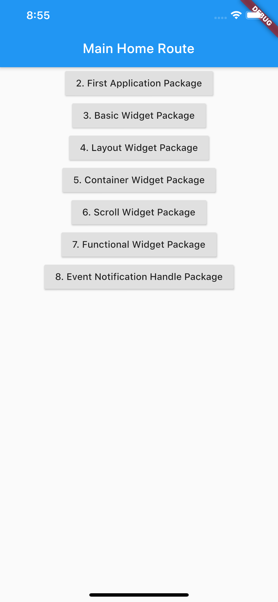

# FlutterProjDemo
#### [《Flutter实战》](https://book.flutterchina.club/)学习代码，通过使用 [Package](https://dart.cn/guides/packages) 来组织每章内容(组件化)


## 一、整合的所有章节示例代码 Demo
打开 [flutter_demo_app](./flutter_demo_app) 目录，在此目录下分别执行命令(前提是已经配置 fluter 命令环境变量)：
```dart
flutter clean
flutter packages get

// 使用iOS模拟器编译【debug模式】【模拟器】【动态库不签名】
flutter build ios --debug --simulator --no-codesign

// 或者使用android模拟器编译
flutter build apk --debug

// 使用命令运行程序，或者使用 IDE 运行
flutter run --debug
```


## 二、章节目录

### 第一章：iOS集成 Flutter Module
目录结构：
- [flutter_module](./1.iOS集成Flutter/flutter_module)：flutter module 代码
- [FlutterIntegrateFramework](./1.iOS集成Flutter/FlutterIntegrateFramework)：iOS 项目中通过手动引用 flutter 生成的 framework 来集成
- [FlutterIntegratePods目录](./1.iOS集成Flutter/FlutterIntegratePods)：使用 CocoaPods 的形式来集成 flutter 相关的 framework

首先进入 [flutter_module](./1.iOS集成Flutter/flutter_module) 目录，执行命令：
```dart
// 清理之前生成的文件
flutter clean

// 拉取依赖库
flutter packages get

// 将flutter编译成 iOS 模拟器 framework
flutter build ios --debug --simulator --no-codesign
```
然后再打开相应的 iOS 工程目录，使用 Xcode 运行工程即可。

### 第十二章：包与插件
进入 [platform_channel_demo](./12.包与插件/platform_channel_demo) 目录
在目录下执行代码
```dart
flutter package get
```
拖动项目文件到 Android Studio 或者其他 IDE 中，运行工程即可
